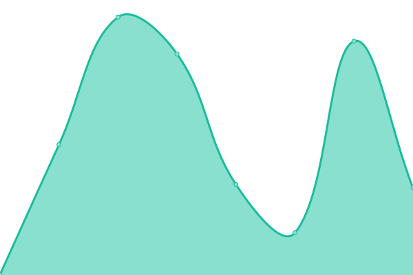

# [📈 Live Status](https://mtauban.github.io/parcelle-uptime): <!--live status--> **🟧 Partial outage**

This repository contains the open-source uptime monitor and status page for [Mathieu Tauban](http://www.mathieutauban.fr), powered by [Upptime](https://github.com/upptime/upptime).

With [Upptime](https://upptime.js.org), you can get your own unlimited and free uptime monitor and status page, powered entirely by a GitHub repository. We use [Issues](https://github.com/mtauban/parcelle-uptime/issues) as incident reports, [Actions](https://github.com/mtauban/parcelle-uptime/actions) as uptime monitors, and [Pages](https://mtauban.github.io/parcelle-uptime) for the status page.

<!--start: status pages-->
<!-- This summary is generated by Upptime (https://github.com/upptime/upptime) -->
<!-- Do not edit this manually, your changes will be overwritten -->
<!-- prettier-ignore -->
| URL | Status | History | Response Time | Uptime |
| --- | ------ | ------- | ------------- | ------ |
|  [Parcelle.app](https://parcelle.app) | 🟩 Up | [parcelle-app.yml](https://github.com/mtauban/parcelle-uptime/commits/HEAD/history/parcelle-app.yml) | 

 952ms
     
 | 

<a href="https://mtauban.github.io/parcelle-uptime/history/parcelle-app">100.00%</a>
    

|  [mathieutauban.fr](https://www.mathieutauban.fr/) | 🟥 Down | [mathieutauban-fr.yml](https://github.com/mtauban/parcelle-uptime/commits/HEAD/history/mathieutauban-fr.yml) | 

 248ms
     
 | 

<a href="https://mtauban.github.io/parcelle-uptime/history/mathieutauban-fr">100.00%</a>
    

|  [fluktify.eu](https://fluktify.eu/) | 🟩 Up | [fluktify-eu.yml](https://github.com/mtauban/parcelle-uptime/commits/HEAD/history/fluktify-eu.yml) | 

 842ms
     
 | 

<a href="https://mtauban.github.io/parcelle-uptime/history/fluktify-eu">100.00%</a>
    

|  [shado.app](https://shado.app/) | 🟩 Up | [shado-app.yml](https://github.com/mtauban/parcelle-uptime/commits/HEAD/history/shado-app.yml) | 

 846ms
     
 | 

<a href="https://mtauban.github.io/parcelle-uptime/history/shado-app">100.00%</a>
    

|  [domainelescabanes.fr](https://domainelescabanes.fr/) | 🟩 Up | [domainelescabanes-fr.yml](https://github.com/mtauban/parcelle-uptime/commits/HEAD/history/domainelescabanes-fr.yml) | 

 1780ms
     
 | 

<a href="https://mtauban.github.io/parcelle-uptime/history/domainelescabanes-fr">100.00%</a>
    

|  [trucmoche.com](https://trucmoche.com/) | 🟩 Up | [trucmoche-com.yml](https://github.com/mtauban/parcelle-uptime/commits/HEAD/history/trucmoche-com.yml) | 

 533ms
     
 | 

<a href="https://mtauban.github.io/parcelle-uptime/history/trucmoche-com">100.00%</a>
    

|  [mtbn.fr](https://mtbn.fr) | 🟩 Up | [mtbn-fr.yml](https://github.com/mtauban/parcelle-uptime/commits/HEAD/history/mtbn-fr.yml) | 

 1943ms
     
 | 

<a href="https://mtauban.github.io/parcelle-uptime/history/mtbn-fr">90.19%</a>
    

<!--end: status pages-->

[**Visit our status website →**](https://mtauban.github.io/parcelle-uptime)

## 📄 License

- Powered by: [Upptime](https://github.com/upptime/upptime)
- Code: [MIT](./LICENSE) © [Mathieu Tauban](http://www.mathieutauban.fr)
- Data in the `./history` directory: [Open Database License](https://opendatacommons.org/licenses/odbl/1-0/)
